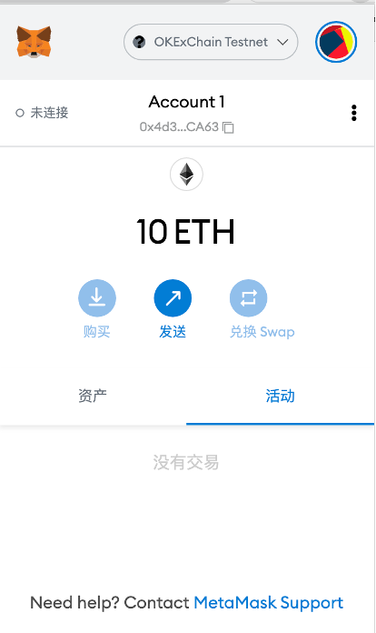
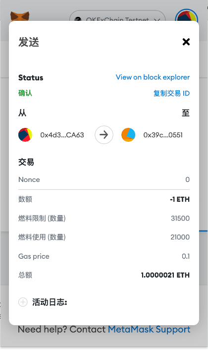
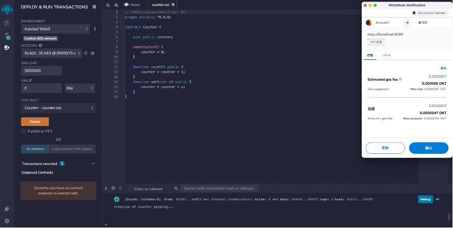
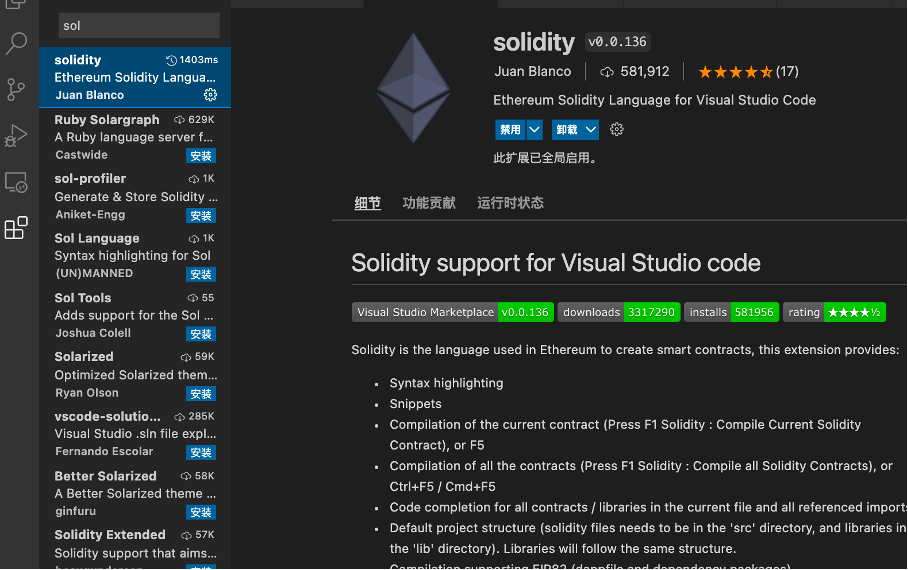
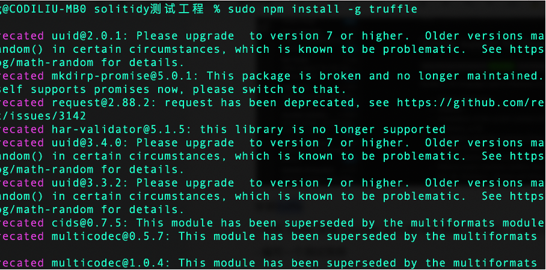
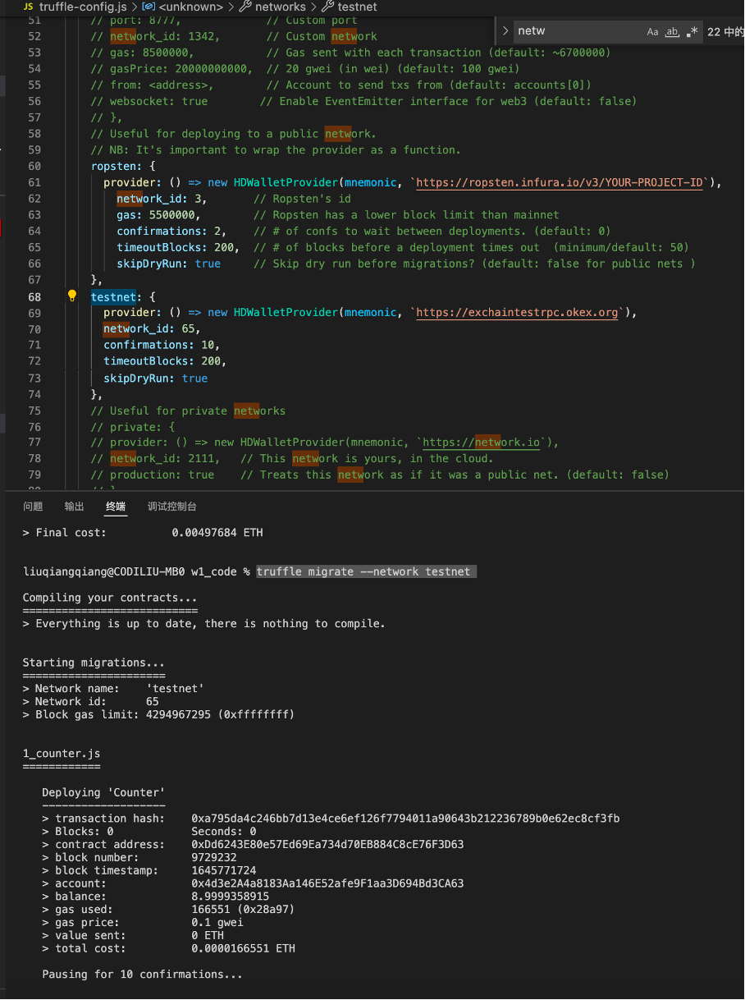
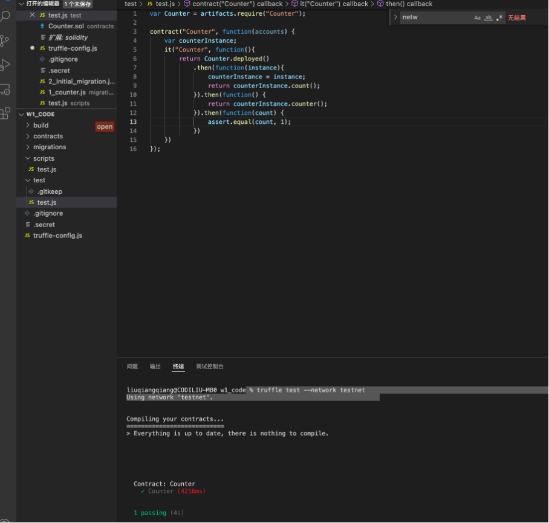

#### **w1_1 作业**
**1. 安装 Metamask、并创建好账号**

**2. 执行一次转账**

交易查询：https://www.oklink.com/zh-cn/oec-test/tx/0xcbe03b98b9952f8da3d712d46289fc37f0bbbe30731c36d25fd96c46ad6385e0

交易hash：CBE03B98B9952F8DA3D712D46289FC37F0BBBE30731C36D25FD96C46AD6385E0

**3. 使用 Remix 创建任意一个合约**

 合约创建交易：https://www.oklink.com/zh-cn/oec-test/tx/0x86ae6c2963d9231ae168580df8ff74554b17f00d14121127a8b1c88d72e97744 
 
 
 
**4. VSCode IDE 开发环境配置**

安装solodity语法高亮插件

安装truffle

**5. 使用 Truffle 部署 Counter 合约 到 test 网络（goerli）（提交交易 hash）**

将合约部署在okex的测试网交易查询：https://www.oklink.com/zh-cn/oec-test/tx/0xa795da4c246bb7d13e4ce6ef126f7794011a90643b212236789b0e62ec8cf3fb

truffle部署合约到okex的truffle-config配置：https://oec-docs.readthedocs.io/en/latest/developers/deploy/truffle.html

如何去申请ropsten的AP_key：https://medium.com/jelly-market/how-to-get-infura-api-key-e7d552dd396f 

**6. 编写一个测试用例**

 

作业要求：
1. 使用自己的 github 创建一个作业代码库
2. 每一次作业使用一个文件夹(w1)
3. 提交代码、截图、交易 hash 等

参考链接：

* okex区块链浏览器：https://www.oklink.com/zh-cn/oec-testok
* 水龙头和添加测试网文档：https://oec-docs.readthedocs.io/en/latest/developers/quick-start.html
* 添加测试网络: https://chainlist.org/
