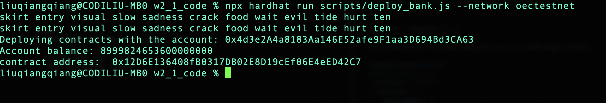
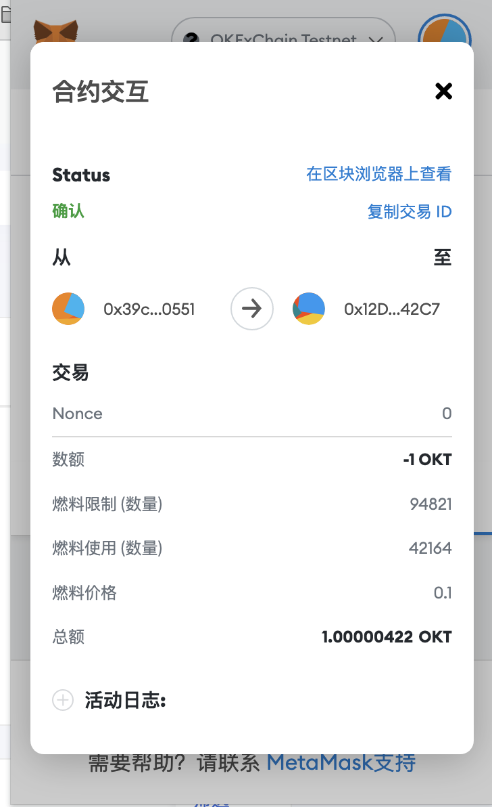

#### **w2_1 作业**
**1. 编写⼀个Bank合约**

合约部署到了OKEXchain的测试链上：https://www.oklink.com/zh-cn/oec-test/address/0x12D6E136408fB0317DB02E8D19cEf06E4eED42C7

**2. 通过 Metamask 向Bank合约转账ETH**

转账交易查询：https://www.oklink.com/zh-cn/oec-test/tx/0xdbc067c2f59e3f8d00efd8b940732e6e913b653daa5347b20b4a57d07f8ce987

**3. 在Bank合约记录每个地址转账⾦额**

代码中使用deposits记录每个地址的转账金额

**4. 编写 Bank合约withdraw(), 实现提取出所有的 ETH**

withdraw调用查询：https://www.oklink.com/zh-cn/oec-test/tx/0C82B9B20F666E56FE80C7F5E5F921B3BDF2D4DE48F5CBF462E5ABDBBA98A50C

