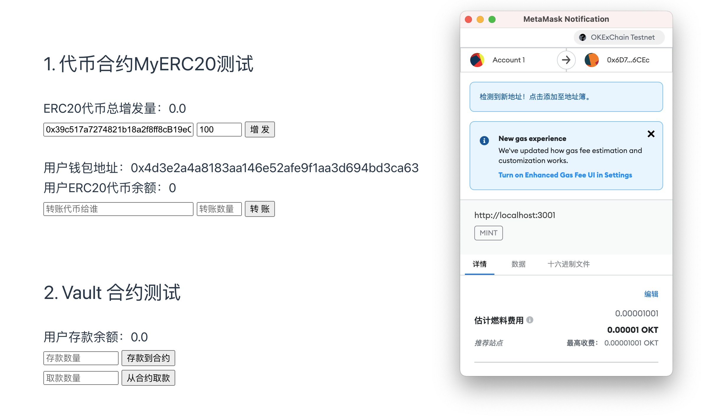
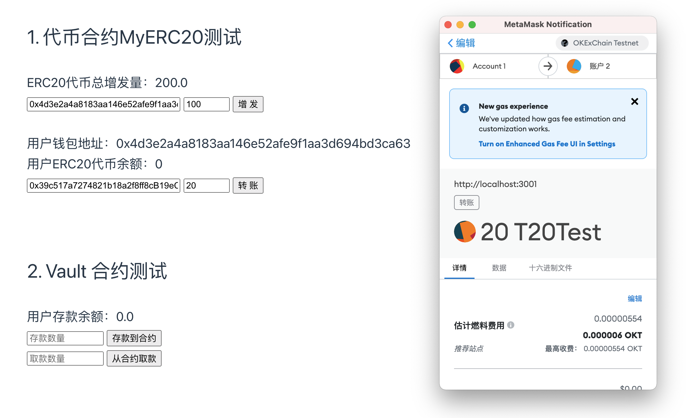
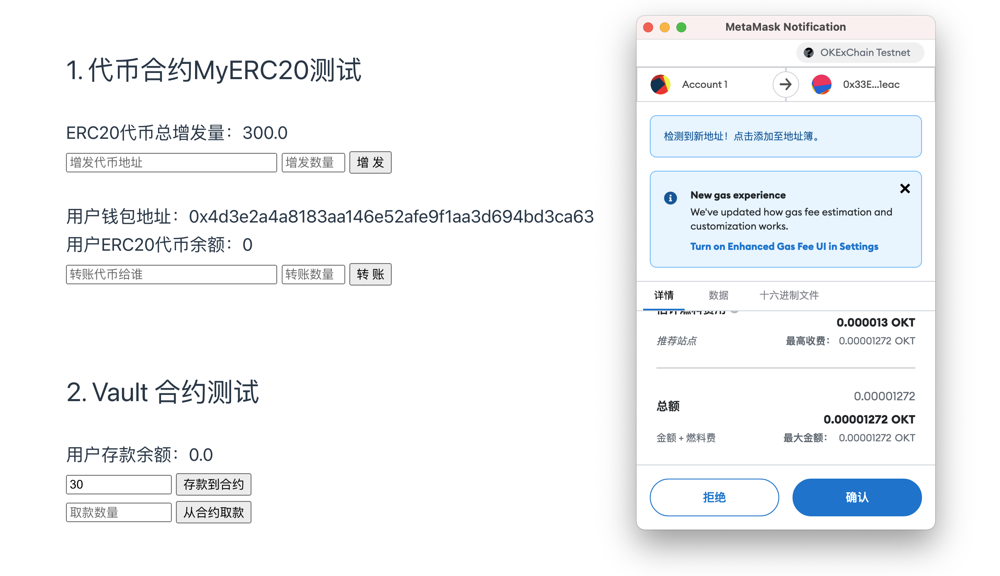
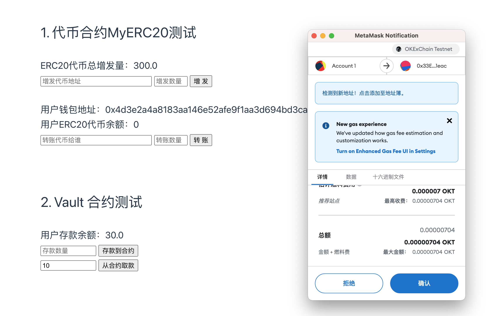

#### **w3_1 作业**

* 发⾏⼀个 ERC20 Token： 
  * 可动态增发（起始发⾏量是 0） 
  * 通过 ethers.js. 调⽤合约进⾏转账
* 编写⼀个Vault 合约：
  * 编写deposite ⽅法，实现 ERC20 存⼊ Vault，并记录每个⽤户存款⾦额 ， ⽤从前端调⽤（Approve，transferFrom） 
  * 编写 withdraw ⽅法，提取⽤户⾃⼰的存款 （前端调⽤）
  * 前端显示⽤户存款⾦

**1. 部署代币MyERC20合约**

https://www.oklink.com/zh-cn/oec-test/address/0x6D7f77E3186B6F1245D0B20d216be15648996CEc

**2. 部署Vault合约**

https://www.oklink.com/zh-cn/oec-test/address/0x33E50D7e2950178e5f70E113B0ce0b0975841eac

**3. 增发**

https://www.oklink.com/zh-cn/oec-test/tx/0xa00cf9bb253ed60b2014ba64c53012623a7159c82105702261b8d8f68b004192

**4. 转账**

https://www.oklink.com/zh-cn/oec-test/tx/0x73461203e9a7aae3e840f6195579925247d8162f1178e83e7a8cc0ae987b5cca

**5. 在合约Vault中调用deposite存入**

批准：https://www.oklink.com/zh-cn/oec-test/tx/0x6687029a4b799ac42a725310aca5e3b6ef2c06697b9af025283172f25089de7b

存入：https://www.oklink.com/zh-cn/oec-test/tx/0xb3ce631c8192c3498d7c8c1d72403d9cba35758b487cf6f3a3c32c7c235b6969

**6. 在合约Vault中调用withdraw提取**

https://www.oklink.com/zh-cn/oec-test/tx/0x7ce36af1101f876e3df082294547fd022d8752070b05ec9b1a30516ab8ce4f8a