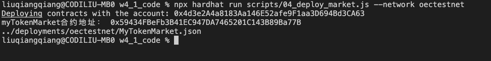

#### **w4_1 作业**

* 部署自己的 ERC20 合约 MyToken
* 编写合约 MyTokenMarket 实现：
   * AddLiquidity():函数内部调用 UniswapV2Router 添加 MyToken 与 ETH 的流动性
   * buyToken()：用户可调用该函数实现购买 MyToken

**1. 部署swap factory**

https://www.oklink.com/zh-cn/oec-test/address/0x351F69c41FB5beA85d326Ea8764406B94bFBfFfC

**2. 部署 swap WETH 合约**

https://www.oklink.com/zh-cn/oec-test/address/0x5D7E12E355f25A2b9dF0a98db8489bd0d8F7BBe3

**3. 部署 swap router合约**

https://www.oklink.com/zh-cn/oec-test/address/0x63A8ed59f73d6B953B574f8e267cba5d1144644a

**4. 部署 MyToken 合约**

https://www.oklink.com/zh-cn/oec-test/address/0x635fCf7a4dF384EF9F1bd486412037E948a721bA

**5. 部署 MyTokenMarket 合约**

https://www.oklink.com/zh-cn/oec-test/address/0x59434FBeFb3B41EC947DA7465201C143B89Ba77B

**6. 在MyTokenMarket 合约添加 MyToken 与 ETH 的流动性**

https://www.oklink.com/zh-cn/oec-test/tx/0xCA5512D27749CFD26DA9A01000AE6268805BB03E812B04934F095E105CF8D86F

**7. 用 MyTokenMarket 合约购买 MyToken**

https://www.oklink.com/zh-cn/oec-test/tx/0x311699D34B162B4AB94E62E098365B3730555C306028E75CAF338AB332736124