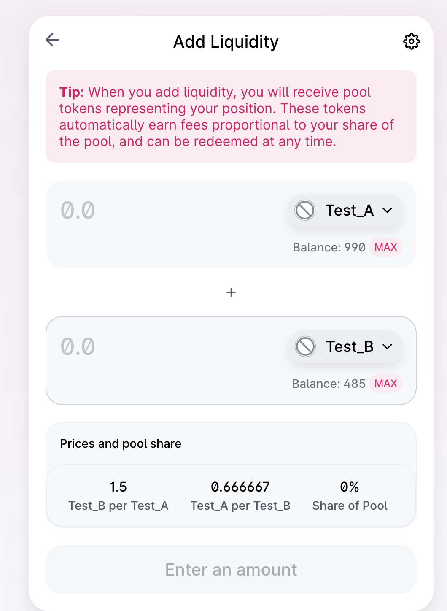

#### **W5_1作业**

* 以太坊测试网上部署两个自己的ERC20合约MyToken，分别在Uniswap V2、V3(网页上)添加流动性
* 作业：编写合约执行闪电贷（参考V2的ExampleFlashSwap）：
   * uniswapV2Call中，用收到的 TokenA 在 Uniswap V3 的 SwapRouter 兑换为 TokenB 还回到 uniswapV2 Pair 中。

**1. 部署Test_A和Test_B**

https://rinkeby.etherscan.io/tx/0x36069d24a1afaca24c1dfdde9dad8043efe751da33780fa26399b34eb4da2cd6

https://rinkeby.etherscan.io/tx/0xfe0705e57f162a2580475b9661f6902a5c1eefec8492ea4c16f1a8889e481229

**2. 在Uniswap v2上调价流动性**

https://rinkeby.etherscan.io/tx/0x24e5e462e41ba560db7b0ee22509f63500794ec8c329d2c3b8321717c8448839

**3. 在Uniswap v3上调价流动性**

https://rinkeby.etherscan.io/tx/0x75e334e3685df2bdb7db14917950e1ba0cbf2dc461c7f4b71586ea15acce0bdd

